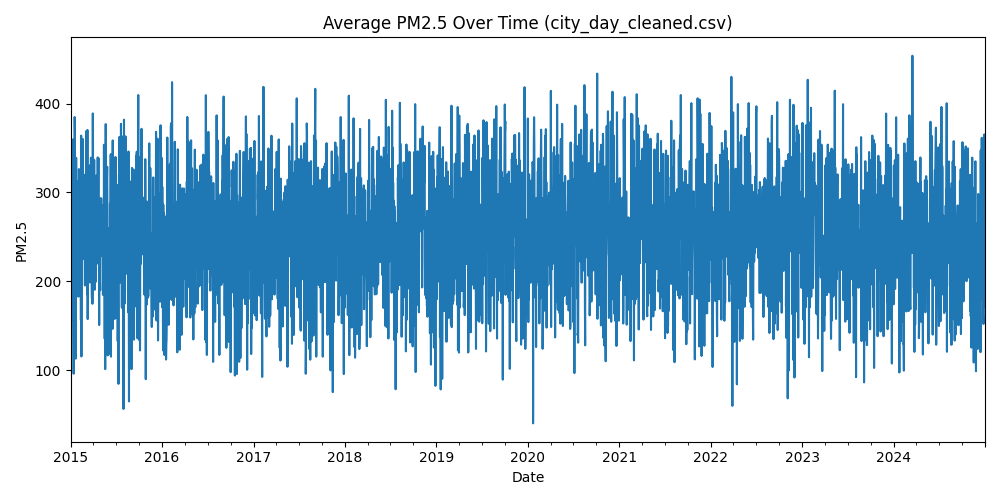
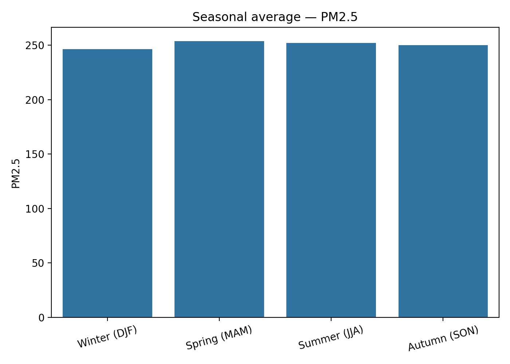
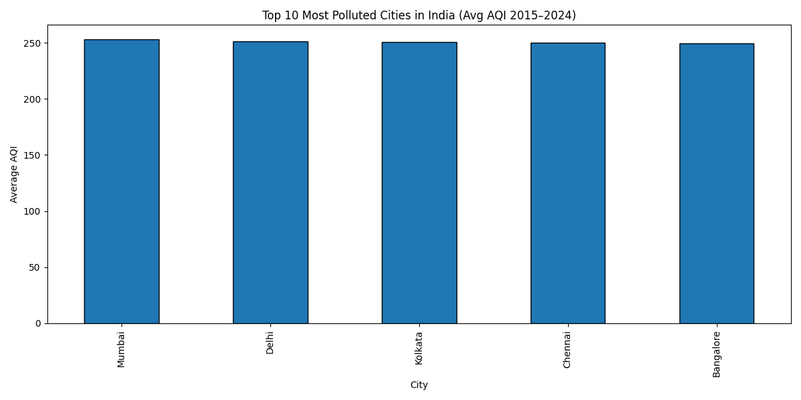
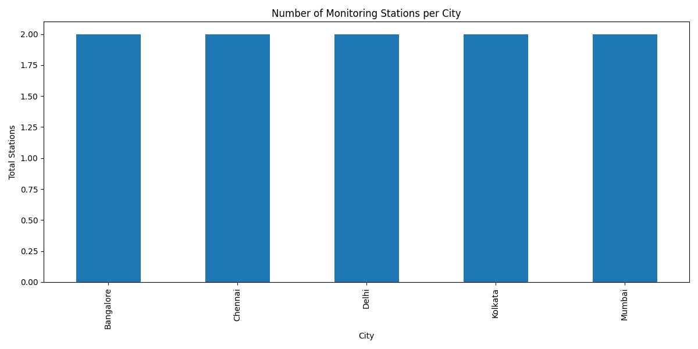

# 🌍 Air Quality Data Analysis (India, 2015–2024)

[](https://www.python.org/)
[](LICENSE)

Analyzing air quality data across major Indian cities from 2015 to 2024.  
This project demonstrates a **complete end-to-end data pipeline**, including **data cleaning, processing, visualization, trend analysis, and city-level insights**, aimed at showcasing skills for **Data Analyst / Data Scientist roles**.

---

## Table of Contents
1. [Overview](#overview)
2. [Problem Statement](#problem-statement)
3. [Project Structure](#project-structure)
4. [Tech Stack](#tech-stack)
5. [Key Features](#key-features)
6. [Key Visualizations](#key-visualizations)
7. [Key Insights](#key-insights)
8. [Installation & Usage](#installation--usage)
9. [Future Enhancements](#future-enhancements)
10. [Contributing](#contributing)
11. [Author](#author)
12. [License](#license)

---

## Overview
This project analyzes **air quality across major Indian cities from 2015 to 2024**, providing insights on pollution trends, hotspots, and seasonal variations.  
It highlights **skills in data cleaning, exploratory data analysis, visualization, and trend reporting**, making it recruiter-friendly.

---

## Problem Statement
Air pollution is a serious concern in India, impacting public health and quality of life.  
This project aims to:
- Identify cities with the highest pollution levels.
- Track trends over the years and across seasons.
- Provide actionable insights for environmental monitoring.

---

## Project Structure
```

air-quality-data-2015-2024/
│
├── data/
│   ├── raw/        # Original CSV files
│   ├── processed/  # Processed datasets
│   └── output/     # Analysis outputs
│
├── visuals/        # Plots, graphs & dashboards
├── scripts/        # Python scripts for analysis
└── notebooks/      # Jupyter notebooks

````

---

## Tech Stack
- **Languages:** Python 3.10+  
- **Libraries:** Pandas, NumPy, Matplotlib, Seaborn  
- **Environment:** Jupyter Notebook / VS Code  
- **Tools:** Git & GitHub  
- **Concepts:** ETL, Time-Series Analysis, Data Visualization, Correlation Analysis

---

## Key Features
- **Automated Data Cleaning:** Removes duplicates, fixes missing values, standardizes dates.  
- **Trend Analysis:** PM2.5 trends over time for each dataset.  
- **Top Polluted Cities:** Ranking of cities by average AQI.  
- **Seasonal Trends:** Average pollutant levels by season.  
- **City Pollution Over Years:** Trends in AQI for top cities.  
- **Station Analysis:** Number of monitoring stations per city.  
- **Pollution Hotspots:** Clustering of cities by pollution levels.

---

## Key Visualizations
### PM2.5 Trends


### Seasonal Pollutant Trends


### Top Polluted Cities


### Pollution Hotspots


### City Pollution Over Years


### Stations per City


---

## Key Insights
- Delhi consistently ranks highest in PM2.5 levels.  
- Winter months show peak pollution across most cities.  
- Southern cities have comparatively lower pollution levels.  
- PM2.5 and PM10 are strongly correlated.  
- AQI improved slightly after the 2020 lockdown.

---

## Installation & Usage

### 1️⃣ Clone & Navigate
```bash
# Clone the repository
git clone https://github.com/abhinav0077/air-quality-india-2015-2024.git
cd air-quality-india-2015-2024
````

### 2️⃣ Install Dependencies

```bash
# Install required Python libraries
pip install pandas numpy matplotlib seaborn plotly streamlit prophet scipy statsmodels
```

### 3️⃣ Run Data Cleaning

```bash
# Run the cleaning script
python scripts/clean_data.py
```

### 4️⃣ Run Analysis & Visualizations

```bash
# Run all analysis scripts
python scripts/analyze_data.py
python scripts/report_top_cities.py
python scripts/yearly_summary.py
python scripts/pollutant_distribution.py
python scripts/city_trend_analysis.py
python scripts/correlation_matrix.py
python scripts/station_stats.py
python scripts/combined_dashboard.py
```

## Contributing

Contributions are welcome!

* Fork the repo
* Create a branch (`git checkout -b feature-name`)
* Make improvements or add features
* Submit a pull request

---

## Author

**Abhinav Verma** – Aspiring Data Analyst / Data Scientist

* LinkedIn: [LinkedIn](https://www.linkedin.com/in/abhinav-verma-0077/)
* GitHub: [abhinav0077](https://github.com/abhinav0077)

---

## License

This project is licensed under the **MIT License** – see the [LICENSE](LICENSE) file for details.
